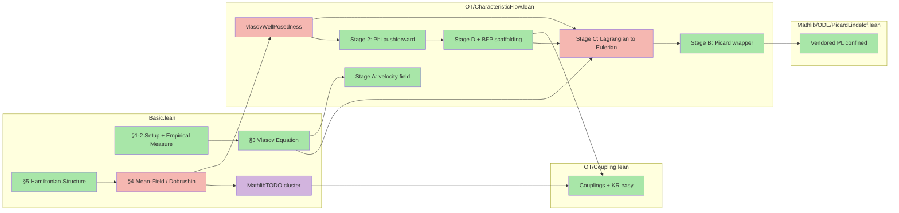

# Vlasov project outline

A Lean 4 / Mathlib formalization of the N-particle Vlasov mean-field derivation (the "Dobrushin route").

## Dependency graph

<!-- Node-collapse decisions:
     Basic.lean has 5 natural tex-section clusters; §1 Setup and §2 Empirical Measure are
     each kept as one node. MathlibTODO placeholders grouped into one "MathlibTODO cluster"
     node. CharacteristicFlow.lean split into Stage A, Stage B, Stage C, Stage D+BFP,
     Stage 2 (Phi), and vlasovWellPosedness. Total: 14 nodes, 15 edges. -->

Legend: green (fill:#a8e6a8) = all proved within node · purple (fill:#d2b4de) = MathlibTODO placeholders · red (fill:#f5b7b1) = contains direct sorry

## Build status

- Result: success (8253 jobs)
- Sorry warnings: 6
- Non-sorry warnings: 26 (style, unused-variable, deprecated-tactic)
- Errors: 0

## Mathematical <-> Lean correspondence

### §1 Setup

| tex label | kind | math statement | Lean declaration | location | status |
|---|---|---|---|---|---|
| `eq:HN` | equation | N-body Hamiltonian H_N(q,p) | [`hamiltonianN`](Vlasov/Vlasov/Basic.lean#L41) | `Basic.lean:L41` | ✅ proved |
| `eq:newton` | definition | Newton solution predicate IsNewtonSolution | [`IsNewtonSolution`](Vlasov/Vlasov/Basic.lean#L60) | `Basic.lean:L60` | ✅ proved |
| `ass:W` | assumption | AssW: W convex, gradW globally Lipschitz | [`AssW`](Vlasov/Vlasov/Basic.lean#L80) | `Basic.lean:L80` | ✅ proved |

### §2 The Empirical Measure

| tex label | kind | math statement | Lean declaration | location | status |
|---|---|---|---|---|---|
| `def:empirical` | definition | Empirical measure mu_N = (1/N) sum delta_{(q_i,p_i)} | [`empiricalMeasure`](Vlasov/Vlasov/Basic.lean#L174) | `Basic.lean:L174` | ✅ proved |
| `prop:weak` | proposition | Empirical measure solves Vlasov weakly along Newton flows | [`weakEvolutionEmpiricalMeasure`](Vlasov/Vlasov/Basic.lean#L557) | `Basic.lean:L557` | ✅ proved |
| `eq:weak-eq` | equation | Distributional/weak form of the Vlasov equation | [`WeakEvolutionEq`](Vlasov/Vlasov/Basic.lean#L674) | `Basic.lean:L674` | ✅ proved |
| `cor:empirical-vlasov` | corollary | Empirical measure solves Vlasov in the weak sense | [`empiricalMeasureSolvesVlasov`](Vlasov/Vlasov/Basic.lean#L698) | `Basic.lean:L698` | ✅ proved |

### §3 The Vlasov Equation

| tex label | kind | math statement | Lean declaration | location | status |
|---|---|---|---|---|---|
| `eq:vlasov` | definition | IsVlasovSolution: measure curve solving Vlasov weakly | [`IsVlasovSolution`](Vlasov/Vlasov/Basic.lean#L755) | `Basic.lean:L755` | ✅ proved |
| `eq:char` | definition | IsCharacteristicFlow: ODE predicate for characteristic curves | [`IsCharacteristicFlow`](Vlasov/Vlasov/Basic.lean#L805) | `Basic.lean:L805` | ✅ proved |
| `thm:vlasov-wp` | theorem | Existence and uniqueness for the Vlasov equation | [`vlasovWellPosedness`](Vlasov/Vlasov/OT/CharacteristicFlow.lean#L3466) | `CharacteristicFlow.lean:L3466` | ❌ sorry |

### §4 The Mean-Field Limit (Dobrushin's Theorem)

| tex label | kind | math statement | Lean declaration | location | status |
|---|---|---|---|---|---|
| `thm:dobrushin` | theorem | Dobrushin stability estimate via W_1 Gronwall | [`dobrushin`](Vlasov/Vlasov/Basic.lean#L2024) | `Basic.lean:L2024` | ✅ proved |
| `eq:dobrushin` | equation | DobrushinStabilityEstimate: W_1(f_t,g_t) <= e^{2Lt} W_1(f_0,g_0) | [`DobrushinStabilityEstimate`](Vlasov/Vlasov/Basic.lean#L2056) | `Basic.lean:L2056` | ✅ proved |
| `cor:mfl` | corollary | Mean-field limit: empirical measure converges to Vlasov solution | [`meanFieldLimit`](Vlasov/Vlasov/Basic.lean#L2082) | `Basic.lean:L2082` | ✅ proved |

### §5 Hamiltonian Structure of the Limit

| tex label | kind | math statement | Lean declaration | location | status |
|---|---|---|---|---|---|
| — | — | (no tex labels assigned in §5 yet) | — (no Lean realisation) | — | — |

---

## Supporting declarations (no `(tex: ...)` reference)

### Basic.lean

- `PhysSpace`, `PhaseSpace` (`Basic.lean:~L20`) — type aliases for Euclidean position and phase space R^d and R^d x R^d.
- `convolveFunctionMeasure` (`Basic.lean:~L100`) — convolution of a function with a measure: int gradW(x-y) d rho(y).
- `spatialMarginal` (`Basic.lean:~L140`) — spatial marginal of a phase-space measure.
- `HasFiniteFirstMoment` (`Basic.lean:~L820`) — predicate: IsProbabilityMeasure mu and Integrable norm mu.
- `wasserstein1` (`Basic.lean:~L900`) — W_1 defined via KR dual sup formula over 1-Lipschitz test functions.
- `wasserstein1_lt_top_of_finite_moment` (`Basic.lean`) — extracts W_1 != top from HasFiniteFirstMoment.
- `IsLagrangianVlasovSolution` (`Basic.lean`) — stronger than IsVlasovSolution; bundles characteristic flow witnesses alongside the weak-PDE conjunct.
- `MathlibTODO_convolveLipschitzEstimate` (`Basic.lean`) — placeholder: Lipschitz bound for the convolution; tagged MathlibTODO.
- `MathlibTODO_W1ContOn_lscNarrow` (`Basic.lean:L1651`) — proved parent: LSC of W_1 along Vlasov curves, composed from sorry'd helper w1_lscNarrow_integralContOn_lip.
- `MathlibTODO_wassersteinGronwallCoupling` (`Basic.lean`) — proved parent: Gronwall coupling for W_1, composed from two sorry'd sub-axioms.
- `supW1On` (`CharacteristicFlow.lean:L2751`) — sup-W_1 pseudodistance used as the Picard contraction metric.
- `VlasovMeasureCurve` (`CharacteristicFlow.lean:L2797`) — bundled structure: narrowly continuous rho curve with uniform first-moment bound M.

### OT/Coupling.lean

- `IsCoupling` (`Coupling.lean:L57`) — marginal predicate: first marginal = mu, second marginal = nu.
- `wasserstein1_coupling` (`Coupling.lean:L74`) — coupling-based W_1 (Monge-Kantorovich infimum over couplings).
- `wasserstein1_le_wasserstein1_coupling` (`Coupling.lean:L111`) — KR easy direction: KR-dual sup <= MK inf. Fully proved (~110 lines).
- `IsCoupling.map` (`Coupling.lean:L239`) — pushforward of a coupling under a measurable map pair.
- `wasserstein1_pushforward_le_iInf` (`Coupling.lean:L270`) — iInf trick for pushed-forward W_1 bounds.

### OT/CharacteristicFlow.lean

- `vlasovVectorField` (`CharacteristicFlow.lean:L50`) — Vlasov vector field: (v, -convolveFunctionMeasure gradW rho x).
- `convolveFunctionMeasure_lipschitz_in_x` (`CharacteristicFlow.lean:L75`) — Lipschitz bound in x for the convolution force field.
- `flow_distance_growth_bound` (`CharacteristicFlow.lean:L127`) — distance-growth bound along the Vlasov ODE.
- `IsCharacteristicFlowOn` (`CharacteristicFlow.lean:L307`) — ODE predicate for characteristic flow restricted to a spatial set.
- `vlasovVectorField_lipschitzWith` (`CharacteristicFlow.lean:L343`) — global Lipschitz constant for the Vlasov vector field.
- `exists_vlasov_characteristicFlow` (`CharacteristicFlow.lean:L957`) — N-window inductive construction of global characteristic flow on a ball. Fully proved.
- `exists_vlasov_characteristicFlow_global_on_ball` (`CharacteristicFlow.lean:L2939`) — Stage 1.7: ball-localised parametric flow (z_0=0, a=2R_0). Fully proved.
- `exists_vlasov_perz_trajectory` (`CharacteristicFlow.lean:L3004`) — Stage 1.9 helper: per-z trajectory for small T satisfying L*(T+1)^2 < 1. Fully proved.
- `exists_vlasov_characteristicFlow_global_smallT` (`CharacteristicFlow.lean:L3201`) — Stage 1.9: true global-in-z flow for small T via Classical.choose bundling. Fully proved.
- `Phi` (`CharacteristicFlow.lean:L3269`) — Stage 2 pushforward operator: Phi charX f0 t = Measure.map (charX t) f0.
- `Phi_isProbabilityMeasure` (`CharacteristicFlow.lean:L3276`) — Stage 2: Phi t is a probability measure under AEMeasurable hypothesis. Fully proved.
- `Phi_hasMoment_le` (`CharacteristicFlow.lean:L3290`) — Stage 2: uniform first-moment bound on Phi under per-z growth hypothesis. Fully proved.

### Mathlib/ODE/PicardLindelof.lean

- `exists_forall_mem_closedBall_eq_hasDerivWithinAt_lipschitzOnWith_confined` (`PicardLindelof.lean:L53`) — vendored PL with confinement + Lipschitz-in-initial-point conjunct. Fully proved.
- `exists_forall_mem_closedBall_eq_forall_mem_Icc_hasDerivWithinAt_confined` (`PicardLindelof.lean:L95`) — thin wrapper dropping the Lipschitz conjunct; consumed by exists_vlasov_extend_one_window. Fully proved.

---

## Open work

| # | Theorem | Location | Category | Blocker (one line) |
|---|---|---|---|---|
| 1 | `w1_lscNarrow_integralContOn_lip` | `Basic.lean:L1392` | abstract sorry (`_lag` closed) | Abstract version remains as a documented Mathlib-OT gap (mollifier approximation + DCT). **Project closure path**: the `_lag` variant `w1_lscNarrow_integralContOn_lip_lag` is closed (routes through `flow_distance_growth_bound` + Lagrangian transformation). |
| 2 | `MathlibTODO_W1ContOn_uscNarrow` | `Basic.lean:L1669` | MathlibTODO | USC of W_1 along Vlasov curves; characteristic-flow coupling argument + W_1 triangle inequality under pushforward not in Mathlib stable API. **No `_lag` variant yet** — needs writing for `dobrushin` / `meanFieldLimit` to route through. |
| 3 | `MathlibTODO_wassersteinGronwallCoupling_derivBound` | `Basic.lean:L1788` | MathlibTODO | Right-derivative Gronwall bound for W_1 coupling; measure-valued Picard theorem + W_1 pushforward contraction not in Mathlib. **No `_lag` variant yet** — needs writing for downstream consumers to route through. |
| 4 | `vlasov_trajectory_lipschitz_bound` | `CharacteristicFlow.lean:L2255` | abstract sorry (`_lag` closed) | SC.8 abstract version: uniform-in-(s,z) speed bound on compact image of trajectory flow. **Project closure path**: the `_lag` variant `vlasov_trajectory_lipschitz_bound_lag` is closed and is what Stage C's chain rule routes through. |
| 5 | `exists_vlasov_characteristicFlow_global_on_ball_measurable` | `CharacteristicFlow.lean:L3416` | direct sorry | Measurability of Stage 1.7 parametric flow; Lipschitz-in-initial-point from vendored PL must be propagated through N-window induction |
| 6 | `vlasovWellPosedness` | `CharacteristicFlow.lean:L3466` | direct sorry | Banach fixed-point construction not started; requires Phi : VlasovMeasureCurve -> VlasovMeasureCurve + contraction in sup-W_1 metric |

---

*Produced by the `codebase-outliner` agent. Re-invoke to refresh.
Inputs: `vlasov.tex`, `Vlasov/Vlasov/*.lean`,
`Vlasov/formalize/plans/*.json`, `lake build` output. Generated:
2026-05-29T15:59:26Z.*
