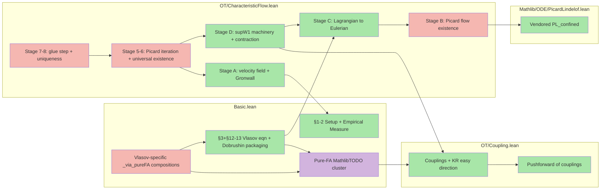

# Vlasov project outline

A Lean 4 / Mathlib formalization of the N-particle Vlasov mean-field derivation
(the "Dobrushin route"), producing the empirical-measure weak evolution, Dobrushin
stability, mean-field limit, and (forward-only) well-posedness for the nonlinear
Vlasov equation.

## Dependency graph

<!-- Node count: 13. Edge count: 17.
     Collapse decisions: merged "§1 Setup + §2 Empirical Measure" into one node
     (both small, fully proved); merged "§3 Vlasov Eqn + §12-13 packaging" as one
     node (thin proved wrappers); split §4 Dobrushin into pure-FA nodes vs
     Vlasov-specific composition to make the Phase 1.5 split visible. -->

Legend: green proved  yellow decomposed (some open)  red direct sorry  purple MathlibTODO

## Build status

- Result: success
- Sorry warnings: 15
- Non-sorry warnings: 176
- Errors: 0

## Mathematical vs Lean correspondence

### §1 Setup

| tex label | kind | math statement | Lean declaration | location | status |
|---|---|---|---|---|---|
| `eq:HN` | equation | Mean-field Hamiltonian for N particles | `hamiltonianN` | `Basic.lean:41` | proved |
| `eq:newton` | equation | N-particle mean-field Newton ODEs | `IsNewtonSolution` | `Basic.lean:60` | proved |
| `ass:W` | assumption | W in C^{1,1}, even, Lip(gradW) < infinity | `AssW` | `Basic.lean:80` | proved |

### §2 The Empirical Measure

| tex label | kind | math statement | Lean declaration | location | status |
|---|---|---|---|---|---|
| `def:empirical` | definition | Empirical measure mu^N = (1/N) sum delta_{(X_i,V_i)} | `empiricalMeasure` | `Basic.lean:174` | proved |
| `prop:weak` | proposition | Weak evolution of empirical measure; remainder bounded by (1/N) norm(gradW) norm(grad_v phi) | `weakEvolutionEmpiricalMeasure` | `Basic.lean:557` | proved |
| `eq:weak-eq` | equation | Distributional evolution identity as Prop predicate | `WeakEvolutionEq` | `Basic.lean:674` | proved |
| `cor:empirical-vlasov` | corollary | Under AssW empirical measure solves Vlasov with R_N = 0 | `empiricalMeasureSolvesVlasov` | `Basic.lean:698` | proved |

### §3 The Vlasov Equation

| tex label | kind | math statement | Lean declaration | location | status |
|---|---|---|---|---|---|
| `eq:vlasov` | equation | Nonlinear Vlasov PDE as distributional predicate on measure curves | `IsVlasovSolution` | `Basic.lean:755` | proved |
| `eq:char` | equation | Mean-field characteristic ODE; self-consistency | `IsCharacteristicFlow`, `IsCharacteristicFlowSelfConsistent` | `Basic.lean:805`, `Basic.lean:820` | proved |
| `thm:vlasov-wp` | theorem | Existence and uniqueness for Vlasov (Dobrushin 1979) | `vlasovWellPosedness` | `CharacteristicFlow.lean:8835` | proved (L < 1 regime; forward-only existence; universal existence arm sorry'd) |

Note on `thm:vlasov-wp`: relocated from Basic.lean to CharacteristicFlow.lean so the proof composes directly with characteristic-flow infrastructure. Statement is forward-only existence (M-series statement-correction: original `exists!` form was overly strong for the forward Cauchy problem). The `L >= 1` regime requires the W-bar refactor (Phase B, deliberate future work). Per-window uniqueness is provided separately by `vlasovWellPosedness_uniqueness` (Stage 8, proved).

### §4 The Mean-Field Limit: Dobrushin's Theorem

| tex label | kind | math statement | Lean declaration | location | status |
|---|---|---|---|---|---|
| `thm:dobrushin` | theorem | Dobrushin 1979: W1(f_t, g_t) <= exp(Ct) W1(f_0, g_0) for all t >= 0 | `dobrushin` | `Basic.lean:2334` | proved (depends on MathlibTODO sub-axioms) |
| `eq:dobrushin` | equation | Exponential W1 stability estimate as reusable Prop | `DobrushinStabilityEstimate` | `Basic.lean:2366` | proved |
| `cor:mfl` | corollary | Mean-field limit: sup W1(mu_t^N, f_t) -> 0 as N -> infinity | `meanFieldLimit` | `Basic.lean:2392` | proved |

## Supporting declarations (no `(tex: ...)` reference)

### Basic.lean

- `gradient_zero_of_even` (Basic.lean:99) — Under AssW (even W), gradient W 0 = 0; used to kill the diagonal correction in empiricalMeasureSolvesVlasov.
- `empiricalMeasureCurve` (Basic.lean:197) — Time-dependent empirical measure along a Newton solution.
- `empiricalMeasure_integral_eq` (Basic.lean:226) — int phi d(empiricalMeasure N X V) = (1/N) * sum phi(X i, V i); decomposer sub-helper.
- `convolveFunctionMeasure` (Basic.lean:212) — Convolution (k * rho)(x) = integral k(x-y) d rho(y).
- `wasserstein1` (Basic.lean:894) — Kantorovich-Rubinstein dual-formula W1 distance returning ENNReal.
- `wasserstein1_lt_top_of_finite_moment` (Basic.lean:908) — W1(mu, nu) < top when both measures have finite first moment.
- `IsLagrangianVlasovSolution` (Basic.lean:862) — Enriched predicate: IsVlasovSolution plus an explicit characteristic flow witness and pushforward equation.
- `HasFiniteFirstMoment` (Basic.lean:773) — IsProbabilityMeasure mu /\ Integrable norm mu.
- `w1_lscNarrow_integralContOn_lip_lag` (Basic.lean:1499) — Lag variant: integral of 1-Lip phi against f(t) is ContinuousOn Icc 0 T, proved via pushforward equation + DCT on fixed measure f(0).
- `W1ContOn_integralContAt` (Basic.lean:1740) — For any IsVlasovSolution f and smooth-CS phi, t -> int phi d(f t) is Continuous.
- `w1ContOn_lscNarrow_via_pureFA` (Basic.lean:1834) — Vlasov-specific W1 LSC composition (Phase 1.5, closed Phase 3 item 4): routes through MathlibTODO_bcNarrowFromSmoothCompactNarrow + MathlibTODO_w1LowerSemicontinuousAlongNarrowMomentCurves. Body proved.
- `MathlibTODO_wassersteinGronwallCoupling_W1ContOn` (Basic.lean:1993) — W1 continuity sub-axiom; composition body proved (closes once USC sorry item 6 is closed).

### OT/CharacteristicFlow.lean

- `vlasovVectorField` (CharacteristicFlow.lean:50) — Phase-space velocity field b(t,z) = (z.2, -(gradW*rho_t)(z.1)).
- `flow_distance_growth_bound` (CharacteristicFlow.lean:127) — Gronwall bound on distance growth along the characteristic ODE.
- `IsCharacteristicFlowOn` (CharacteristicFlow.lean:472) — Localized characteristic flow on an open time interval Ioo 0 T.
- `IsVlasovSolutionOn` / `IsLagrangianVlasovSolutionOn` (CharacteristicFlow.lean:551, 576) — On-predicates for local-in-T existence and gluing (B1-style predicate enrichment).
- `VlasovMeasureCurve` (CharacteristicFlow.lean:3869) — Bundle: probability-measure curve on [0,T] with moment bound M and W1-continuity record.
- `supW1On` (CharacteristicFlow.lean:3736) — Sup of W1 over a set of times; ENNReal pseudometric for the Picard iteration.
- `Phi` (CharacteristicFlow.lean:4477) — Picard operator: given VlasovMeasureCurve mu, outputs pushforward of f0 under the characteristic flow of mu.
- `Phi_supW1_contraction` (CharacteristicFlow.lean:5730) — Phi is a contraction in supW1On under LocalSmallness.
- `exists_vlasov_characteristicFlow` (CharacteristicFlow.lean:1243) — N-window inductive global characteristic flow existence.
- `vlasovTrajectoryLipschitzBound` (CharacteristicFlow.lean:2712) — Flow map (charX t, charV t) is Lipschitz in z; closed in Phase 3 item 2.
- `vlasovSolutionViaPushforward_isLagrangianVlasovSolutionOn` (CharacteristicFlow.lean:3594) — Stage C: the pushforward of f0 under the characteristic flow is a Lagrangian Vlasov solution on [0,T].
- `vlasovWellPosedness_local` (CharacteristicFlow.lean:6977) — Local well-posedness on [0, T0]; glue of three sub-helpers, body closed.
- `vlasovWellPosedness_uniqueness` (CharacteristicFlow.lean:8509) — Per-window uniqueness of IsLagrangianVlasovSolutionOn solutions with same initial data; proved.

### OT/Coupling.lean

- `IsCoupling` (Coupling.lean:57) — Product measure coupling predicate; marginals match mu, nu.
- `wasserstein1_coupling` (Coupling.lean:74) — W1 distance via coupling integral rather than KR dual.
- `wasserstein1_le_wasserstein1_coupling` (Coupling.lean:111) — KR easy direction: W1 <= coupling integral norm.
- `IsCoupling.map` (Coupling.lean:239) — Pushforward preserves couplings.
- `wasserstein1_pushforward_le_iInf` (Coupling.lean:270) — W1 of pushforward measures bounded by inf over couplings.

### Mathlib/ODE/PicardLindelof.lean

- `exists_forall_mem_closedBall_eq_hasDerivWithinAt_lipschitzOnWith_confined` (PicardLindelof.lean:53) — Vendored PL_confined: Picard-Lindelof existence for ODE confined to a closed ball.
- `exists_forall_mem_closedBall_eq_forall_mem_Icc_hasDerivWithinAt_confined` (PicardLindelof.lean:95) — Variant with Icc-time HasDerivWithinAt conclusion used by Stage B wrapper.

## Open work

| # | Theorem | Location | Category | Blocker (one line) |
|---|---|---|---|---|
| 1 | `MathlibTODO_cauchyW1_hasNarrowLimit` | `Basic.lean:L1148` | MathlibTODO | Prokhorov + narrow-tightness for Cauchy-in-W1 sequences; Mathlib OT infrastructure gap |
| 2 | `MathlibTODO_convolveContinuousAtOfNarrowMoment` | `Basic.lean:L1448` | MathlibTODO | Villani Ch.6 narrow-to-W1 upgrade for convolution continuity; Bucket-1 PR scope |
| 3 | `MathlibTODO_w1LowerSemicontinuousAlongNarrowMomentCurves` | `Basic.lean:L1715` | MathlibTODO | Villani Thm 5.10 LSC of W1 along narrow curves; pure functional-analytic, Bucket-1 |
| 4 | `MathlibTODO_bcNarrowFromSmoothCompactNarrow` | `Basic.lean:L1794` | MathlibTODO | BC-extension from smooth-CS narrow; standard Polish probability theory, Bucket-1 |
| 5 | `MathlibTODO_w1UpperSemicontinuousAlongLagrangianFlows` | `Basic.lean:L1905` | MathlibTODO | USC of W1 via Lagrangian-pushforward coupling DCT; Bucket-2 (requires char-flow coupling API) |
| 6 | `w1ContOn_uscNarrow_via_pureFA` | `Basic.lean:L1939` | direct sorry | Vlasov-specific USC composition; deferred until IsLagrangianVlasovSolution upgrade (Phase 4 item 3) |
| 7 | `MathlibTODO_w1RightDerivBoundAlongLagrangianFlows` | `Basic.lean:L2051` | MathlibTODO | Gronwall right-deriv liminf bound for W1 between Lagrangian flows; Bucket-2 |
| 8 | `wassersteinGronwallCoupling_derivBound_via_pureFA` | `Basic.lean:L2098` | direct sorry | Vlasov-specific derivBound composition; blocked on IsLagrangianVlasovSolution upgrade (Phase 4 item 1) |
| 9 | `MathlibTODO_lipschitzFlowTrajectoryLipBound` | `CharacteristicFlow.lean:L2674` | MathlibTODO | Picard-iterate Lipschitz-in-initial-condition bound; pure ODE regularity, Bucket-1 |
| 10 | `MathlibTODO_lipschitzFlowAEMeasurable` (private) | `CharacteristicFlow.lean:L6247` | MathlibTODO | AEMeasurability of Lipschitz ODE flow; Hartman-type ODE regularity, Bucket-1 |
| 11 | `picardCharFlow_aemeasurable` (private) | `CharacteristicFlow.lean:L6272` | direct sorry | Vlasov-specific AEMeas composition; blocked on item 10 above |
| 12 | `vlasovWellPosedness_local_picard_fixedPointFlow` | `CharacteristicFlow.lean:L6349` | direct sorry | Picard fixed-point flow construction (load-bearing Stage 5 math, ~150-220 lines); Phase 2-4 target |
| 13 | `vlasovWellPosedness_glue_step` | `CharacteristicFlow.lean:L7294` | direct sorry | Inductive gluing of per-window Lagrangian solutions; Phase 4 pending item 5 (Lagrangian-upgrade swing) |
| 14 | `dobrushin_uniqueness_On` (private) | `CharacteristicFlow.lean:L8484` | direct sorry | Localized Dobrushin uniqueness via Gronwall; Phase 4 pending item 6 (reclassified from MathlibTODO) |
| 15 | `vlasovWellPosedness_universal_existence` | `CharacteristicFlow.lean:L8578` | direct sorry | Forward-universal existence via window iteration; deferred (blocked on glue_step, item 13) |

### Pure-FA vs Vlasov-specific split (Phase 1.5 architecture)

The Phase 1.5 decomposition separates the sorry'd work into two buckets visible in the
open-work table above:

**Pure-FA MathlibTODO cluster** (open-work items 1-5, 7, 9, 10): standard results from
optimal transport (Villani) or ODE theory (Hartman/Coddington-Levinson) that should
eventually become Mathlib PRs. Named with `MathlibTODO_` prefix. No Vlasov-specific
content in their statements.

**Vlasov-specific composition sorries** (items 6, 8, 11, 12, 13, 14, 15): depend on
the pure-FA placeholders AND require Vlasov infrastructure (characteristic flows,
IsLagrangianVlasovSolution upgrade). Phase 2-4 targets.

**Phase 3 closed items** (now proved):
- `vlasovTrajectoryLipschitzBound` (CharacteristicFlow.lean:2712) — Phase 3 item 2.
- `w1ContOn_lscNarrow_via_pureFA` (Basic.lean:1834) — Phase 3 item 4; a substantive
  Vlasov-specific composition orchestrating the Phase 1.5 pure-FA stubs.

**Phase 4 pending items** (from planning-notes Phase 3 deferral list, indexed by
their open-work row numbers above): item 8 = Phase 4 item 1, item 6 = item 3,
item 13 = item 5, item 14 = item 6. All deferred pending the "Lagrangian-upgrade
architectural swing."

---

*Produced by the `codebase-outliner` agent. Re-invoke to refresh.
Inputs: `vlasov.tex`, `Vlasov/Vlasov/Basic.lean`, `Vlasov/Vlasov/OT/CharacteristicFlow.lean`,
`Vlasov/Vlasov/OT/Coupling.lean`, `Vlasov/Vlasov/Mathlib/ODE/PicardLindelof.lean`,
`Vlasov/formalize/plans/*.json`, `lake build` output. Generated: 2026-05-30T00:00:00Z.*
