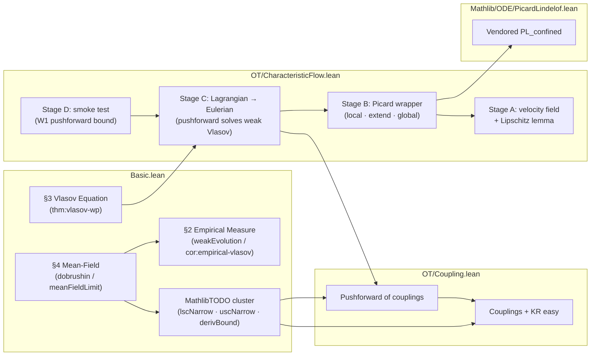

# Vlasov project outline

A Lean 4 / Mathlib formalization of the N-particle Vlasov mean-field derivation (the "Dobrushin route").

## Dependency graph

<!-- Collapse decisions: §1 Setup folded into "§2 Empirical Measure" node (no
own theorems beyond `hamiltonianN`/`AssW`); §5 Hamiltonian Structure omitted
(no Lean realisation). MathlibTODO_W1ContOn (lsc + usc) and
MathlibTODO_derivBound merged into a single "MathlibTODO cluster" node
(all three are 📦 placeholders with the same blocker). -->

Legend: green = all proved · yellow = decomposed, some open · red = direct sorry · purple = MathlibTODO placeholder.

Per-node status (worst-of-contents):
- `S2` 🟢 proved (`weakEvolutionEmpiricalMeasure`, `empiricalMeasureSolvesVlasov` closed).
- `S3` 🔴 sorry (`vlasovWellPosedness` is a direct sorry).
- `S4` 🟢 proved (`dobrushin`, `meanFieldLimit` close via decomposed helpers; transitive trust sits inside `MTC`).
- `MTC` 🟣 MathlibTODO (3 placeholders open: `_W1ContOn_lscNarrow`, `_W1ContOn_uscNarrow`, `_wassersteinGronwallCoupling_derivBound`).
- `CKR`, `CPF` 🟢 proved.
- `SA`, `SB`, `SD` 🟢 proved.
- `SC` 🔴 sorry (one bundled sub-sorry inside `vlasovSolutionViaPushforward_isVlasovSolution` for `h_diff_data` regularity).
- `VPL` 🟢 proved (vendored from Mathlib, awaiting upstream PR).

## Build status

- Result: ✓ success (`Build completed successfully (8253 jobs).`)
- Sorry warnings: 5
- Non-sorry warnings: 58 (unused variables, `push_neg` deprecation, `show`-vs-`change` lints, long-line lints)
- Errors: 0

### Sorry crosscheck

Spec asks for `build sorries == open-work rows == correspondence ❌/📦 count`.
Observed:
- Build sorries: **5**
- Open-work table rows: **5**
- Correspondence table ❌/📦 rows: **1** (only `thm:vlasov-wp ↔ vlasovWellPosedness` carries an open status, because the four other sorried declarations are project-internal placeholders without a `\label{...}` counterpart in `vlasov.tex`).

The 4-row gap is structural, not an inconsistency: `MathlibTODO_*` placeholders and the `vlasovSolutionViaPushforward_isVlasovSolution` sub-sorry exist to fill Mathlib API holes / Stage C regularity hypotheses that the paper takes for granted. They are tracked in the open-work table but cannot appear in the correspondence table.

## Mathematical ↔ Lean correspondence

### §1 Setup

| tex label | kind | math statement | Lean declaration | location | status |
|---|---|---|---|---|---|
| `eq:HN` | equation | Mean-field Hamiltonian `H_N(X,V) = Σᵢ|vᵢ|²/2 + (1/N)Σᵢ<ⱼ W(xᵢ−xⱼ)` | [`hamiltonianN`](Vlasov/Vlasov/Basic.lean#L41) | `Basic.lean:41` | ✅ |
| `eq:newton` | equation | Hamilton/Newton equations `ẋᵢ = vᵢ, v̇ᵢ = −(1/N)Σⱼ≠ᵢ ∇W(xᵢ−xⱼ)` | [`IsNewtonSolution`](Vlasov/Vlasov/Basic.lean#L60) | `Basic.lean:60` | ✅ |
| `ass:W` | assumption | `W ∈ C^{1,1}(ℝᵈ)`, even, with `Lip(∇W) = L < ∞` | [`AssW`](Vlasov/Vlasov/Basic.lean#L80) | `Basic.lean:80` | ✅ |

### §2 The Empirical Measure

| tex label | kind | math statement | Lean declaration | location | status |
|---|---|---|---|---|---|
| _(unlabeled definition)_ | definition | Empirical measure `μᴺ[Z] := (1/N)Σᵢ δ_(xᵢ,vᵢ)` | [`empiricalMeasure`](Vlasov/Vlasov/Basic.lean#L174), [`empiricalMeasureCurve`](Vlasov/Vlasov/Basic.lean#L197) | `Basic.lean:174, 197` | ✅ |
| `prop:weak` | proposition | Weak evolution of the empirical measure (with `O(1/N)` diagonal residual) | [`weakEvolutionEmpiricalMeasure`](Vlasov/Vlasov/Basic.lean#L557) | `Basic.lean:557` | 🔧 (6/6 closed) |
| `eq:weak-eq` | equation | `d/dt⟨μᴺ,φ⟩ = ⟨μᴺ, v·∇ₓφ − (∇W∗ρᴺ)·∇ᵥφ⟩ + Rᴺ` | [`WeakEvolutionEq`](Vlasov/Vlasov/Basic.lean#L674) | `Basic.lean:674` | ✅ |
| `cor:empirical-vlasov` | corollary | Under `ass:W`, the empirical measure satisfies the weak Vlasov equation with `Rᴺ ≡ 0` | [`empiricalMeasureSolvesVlasov`](Vlasov/Vlasov/Basic.lean#L698) | `Basic.lean:698` | ✅ |

Helpers under `weakEvolutionEmpiricalMeasure` (via `formalize/plans/weakEvolutionEmpiricalMeasure.json`):
  - `empiricalMeasure_integral_eq` (Basic.lean:226) — ✅
  - `hasDerivAt_phi_along_trajectory` (Basic.lean:251) — ✅
  - `hasDerivAt_empiricalIntegral_sum` (Basic.lean:305) — ✅
  - `convolveFunctionMeasure_empiricalSpatial_eq` (Basic.lean:372) — ✅
  - `diagonalCorrection_eq` (Basic.lean:412) — ✅
  - `diagonalCorrection_bound` (Basic.lean:490) — ✅

### §3 The Vlasov Equation

| tex label | kind | math statement | Lean declaration | location | status |
|---|---|---|---|---|---|
| `eq:vlasov` | equation | `∂_t f + v·∇ₓf − (∇W∗ρ_t)·∇ᵥf = 0` (distributional sense) | [`IsVlasovSolution`](Vlasov/Vlasov/Basic.lean#L755) | `Basic.lean:755` | ✅ |
| `thm:vlasov-wp` | theorem | Existence and uniqueness for Vlasov: `∃! f` narrowly continuous solving `eq:vlasov` from `f₀ ∈ 𝒫₁` | [`vlasovWellPosedness`](Vlasov/Vlasov/Basic.lean#L784) | `Basic.lean:784` | ❌ |
| `eq:char` | equation | Characteristic ODE `Ẋ = V, V̇ = −(∇W∗ρ_t)(X)` and `f_t = (X,V)_# f₀` | [`IsCharacteristicFlow`](Vlasov/Vlasov/Basic.lean#L822), [`IsCharacteristicFlowSelfConsistent`](Vlasov/Vlasov/Basic.lean#L837), [`vlasovSolutionViaPushforward`](Vlasov/Vlasov/Basic.lean#L846) | `Basic.lean:822, 837, 846` | ✅ |

### §4 The Mean-Field Limit: Dobrushin's Theorem

| tex label | kind | math statement | Lean declaration | location | status |
|---|---|---|---|---|---|
| `thm:dobrushin` | theorem | Dobrushin, 1979: `∃ C>0, ∀t≥0, W₁(f_t,g_t) ≤ e^{Ct}·W₁(f₀,g₀)` | [`dobrushin`](Vlasov/Vlasov/Basic.lean#L1603) | `Basic.lean:1603` | 🔧 (5/5 closed*) |
| `eq:dobrushin` | equation | Exponential `W₁` stability estimate, packaged as a predicate | [`DobrushinStabilityEstimate`](Vlasov/Vlasov/Basic.lean#L1635) | `Basic.lean:1635` | ✅ |
| `cor:mfl` | corollary | Mean-field limit: `sup_{t≤T} W₁(μₜᴺ, fₜ) → 0` as `N → ∞` if initial empirical converges | [`meanFieldLimit`](Vlasov/Vlasov/Basic.lean#L1661) | `Basic.lean:1661` | ✅ |

Helpers under `dobrushin` (via `formalize/plans/dobrushin.json`):
  - `dobrushin_C_choice` (Basic.lean:1508) — ✅
  - `convolveDiff_norm_le` (Basic.lean:1518) — ✅ (relays through proved `MathlibTODO_convolveLipschitzEstimate`)
  - `wasserstein1_ofReal_exp_monotone` (Basic.lean:1534) — ✅
  - `dobrushin_ennreal_bound` (Basic.lean:1546) — ✅ (relays through proved `MathlibTODO_wassersteinGronwallCoupling`)
  - `dobrushin_package_exists` (Basic.lean:1572) — ✅

*The five direct helpers of `dobrushin` are syntactically closed; transitive trust sits inside `MathlibTODO_wassersteinGronwallCoupling`, which is itself proved via `_W1ContOn` + `_derivBound`, of which `_W1ContOn` is proved via `_lscNarrow` + `_uscNarrow` (both 📦 open in the MathlibTODO cluster) and `_derivBound` is itself 📦 open.

### §5 Hamiltonian Structure of the Limit

No tex labels in source; no Lean realisation (the paper sketches the Lie–Poisson structure but defers a rigorous treatment to `\cite{MNPRS}`).

## Supporting declarations (no `(tex: …)` reference)

### `Basic.lean`

- `PhysSpace` (Basic.lean:24) — Abbreviation for ℝᵈ as a Euclidean space.
- `PhaseSpace` (Basic.lean:27) — Abbreviation for the single-particle phase space ℝᵈ × ℝᵈ.
- `gradient_zero_of_even` (Basic.lean:99) — Under `[AssW W]` (even + differentiable), `gradient W 0 = 0`.
- `empiricalMeasure_isProbabilityMeasure` (Basic.lean:185) — When N ≥ 1 the empirical measure is a probability measure.
- `convolveFunctionMeasure` (Basic.lean:212) — Convolution of a function with a finite measure: `(k * ρ)(x) := ∫ k(x−y) dρ(y)`.
- `spatialMarginal` (Basic.lean:217) — Spatial marginal of a measure on phase space (`Measure.map Prod.fst`).
- `HasFiniteFirstMoment` (Basic.lean:773) — Probability measure on PhaseSpace d with `Integrable (·.norm)`.
- `wasserstein1` (Basic.lean:875) — KR-dual definition of `W₁`, valued in `ℝ≥0∞`.
- `wasserstein1_lt_top_of_finite_moment` (Basic.lean:889) — `W₁(μ,ν) < ⊤` for probability measures with finite first moment.
- `wasserstein1_ne_top_of_finite_moment` (Basic.lean:964) — `W₁(μ,ν) ≠ ⊤` under the same hypotheses.
- Helper cascade for `MathlibTODO_convolveLipschitzEstimate` (lines 1016–1222): `convolveLipschitz_inner_lipschitz`, `convolveLipschitz_KR_le`, `convolveLipschitz_inner_bound`, `convolveLipschitz_norm_le_of_inner_forall`; parent `MathlibTODO_convolveLipschitzEstimate` (Basic.lean:1205) — all ✅.
- Helper cascade for `MathlibTODO_wassersteinGronwallCoupling_W1ContOn` (lines 1265–1359): `W1ContOn_lt_top`, `W1ContOn_integralContAt`, `W1ContOn_toRealContOn`; parent `MathlibTODO_wassersteinGronwallCoupling_W1ContOn` (Basic.lean:1328) — all ✅ modulo the 📦 `_lscNarrow`/`_uscNarrow` it composes.
- Helper cascade for `MathlibTODO_wassersteinGronwallCoupling` (lines 1390–1504): `wassersteinGronwallCoupling_gronwall_le`, `wassersteinGronwallCoupling_real_bound`, `wassersteinGronwallCoupling_ennreal_mul_comm`, `wassersteinGronwallCoupling_ofReal_le`; parent `MathlibTODO_wassersteinGronwallCoupling` (Basic.lean:1490) — all ✅.

### `OT/Coupling.lean`

- `IsCoupling` (Coupling.lean:57) — Measure on a product space with prescribed marginals.
- `wasserstein1_coupling` (Coupling.lean:74) — Monge-Kantorovich `W₁` via infimum of `∫⁻ edist dπ` over couplings.
- `wasserstein1_le_wasserstein1_coupling` (Coupling.lean:111) — KR easy direction: dual-formula `W₁` ≤ coupling-formula `W₁`.
- `IsCoupling.map` (Coupling.lean:239) — Pushforward of a coupling under `(Φ, Ψ)` is a coupling of the marginals' pushforwards.
- `wasserstein1_pushforward_le_iInf` (Coupling.lean:270) — `W₁(Φ_#μ, Ψ_#ν) ≤ ⨅_π ∫⁻ edist(Φz.1, Ψz.2) dπ`; bridges OT to characteristic flows.

### `OT/CharacteristicFlow.lean`

- `vlasovVectorField` (CharacteristicFlow.lean:50) — Phase-space vector field `(v, −(∇W∗ρ_t)(x))`.
- `convolveFunctionMeasure_lipschitz_in_x` (CharacteristicFlow.lean:75) — Stage A: position-side L-Lipschitz of `∇W ∗ ρ`.
- `IsCharacteristicFlowOn` (CharacteristicFlow.lean:158) — Localized variant of `IsCharacteristicFlow` over a time set.
- `IsCharacteristicFlowOn.mono` (CharacteristicFlow.lean:173) — Monotonicity in time set and pointwise data.
- `vlasovVectorField_lipschitzWith` (CharacteristicFlow.lean:194) — Joint Lipschitz constant for `(v, −(∇W∗ρ)(x))`.
- `vlasovVectorField_norm_le` (CharacteristicFlow.lean:225) — Pointwise norm bound on the vector field.
- `exists_vlasov_characteristicFlow_local` (CharacteristicFlow.lean:252) — Stage B (local): Picard-Lindelöf on a window.
- `exists_vlasov_extend_one_window` (CharacteristicFlow.lean:421) — Per-z, time-shifted single-trajectory Picard with velocity bound.
- `vlasov_window_confinement` (CharacteristicFlow.lean:609) — Helper 1: phase-space ball confinement on a window.
- `vlasov_window_velocity_bound` (CharacteristicFlow.lean:662) — Helper 2: window-wide velocity bound.
- `vlasov_window_position_bound` (CharacteristicFlow.lean:743) — Helper 3: window endpoint position bound.
- `exists_vlasov_characteristicFlow` (CharacteristicFlow.lean:808) — Stage B (global): characteristic flow on `[0, T]` via N-window induction.
- `exists_vlasov_characteristicFlow_twoWindow` (CharacteristicFlow.lean:1518) — Two-window specialization (smoke test for the induction).
- `vlasov_pushforward_integral_eq_compose` (CharacteristicFlow.lean:1709) — SC.1: integral change-of-variables for the pushforward.
- `vlasov_traj_chain_rule` (CharacteristicFlow.lean:1732) — SC.2: pointwise chain rule along the trajectory.
- `DiffUnderIntegralData` (CharacteristicFlow.lean:1844) — Dominated-bundle data for SC.3.
- `vlasov_pushforward_hasDerivAt_under_integral` (CharacteristicFlow.lean:1884) — SC.3: differentiation under the integral.
- `vlasov_rhs_pushforward_back` (CharacteristicFlow.lean:1920) — SC.4: push the chain-rule RHS back through `integral_map`.
- `wasserstein1_lagrangian_pushforward_bound` (CharacteristicFlow.lean:2132) — Stage D smoke test: `W₁` bound via pushed-forward couplings.

### `Mathlib/ODE/PicardLindelof.lean`

- `IsPicardLindelof.exists_forall_mem_closedBall_eq_hasDerivWithinAt_lipschitzOnWith_confined` (PicardLindelof.lean:53) — Vendored PL with the confinement conjunct exposed; awaiting upstream PR.
- `IsPicardLindelof.exists_forall_mem_closedBall_eq_forall_mem_Icc_hasDerivWithinAt_confined` (PicardLindelof.lean:95) — Thin wrapper dropping the Lipschitz-in-initial-point conclusion; consumed by `exists_vlasov_extend_one_window`.

## Open work

| # | Theorem | Location | Category | Blocker (one line) |
|---|---|---|---|---|
| 1 | `vlasovWellPosedness` | `Basic.lean:L784` | direct sorry | Banach fixed-point existence/uniqueness for the measure-valued Vlasov flow not started; the characteristic-flow infrastructure in `OT/CharacteristicFlow.lean` (Stage B + Stage C) is the intended supplier but not yet wired in. |
| 2 | `MathlibTODO_W1ContOn_lscNarrow` | `Basic.lean:L1233` | MathlibTODO | KR duality for non-compactly-supported Lipschitz test functions; not available in Mathlib's stable OT/measure-valued-ODE API. |
| 3 | `MathlibTODO_W1ContOn_uscNarrow` | `Basic.lean:L1248` | MathlibTODO | Requires characteristic-flow coupling argument + `W₁` triangle inequality under pushforward; neither is in Mathlib's stable OT API. |
| 4 | `MathlibTODO_wassersteinGronwallCoupling_derivBound` | `Basic.lean:L1367` | MathlibTODO | Coupling-flow argument + measure-valued Picard theorem + `W₁` pushforward contraction; none in Mathlib's stable API. |
| 5 | `vlasovSolutionViaPushforward_isVlasovSolution` | `CharacteristicFlow.lean:L1975` | direct sorry | Stage C bundled sub-sorry: `h_diff_data` `DiffUnderIntegralData` regularity (product-fderiv decomposition + diff-under-integral) — to be discharged by upstream regularity layer (`vlasovWellPosedness`). |

---

*Produced by the `codebase-outliner` agent. Re-invoke to refresh.
Inputs: `vlasov.tex`, `Vlasov/Vlasov/*.lean`,
`Vlasov/formalize/plans/*.json`, `lake build` output. Generated:
2026-05-28T20:40:26Z.*
