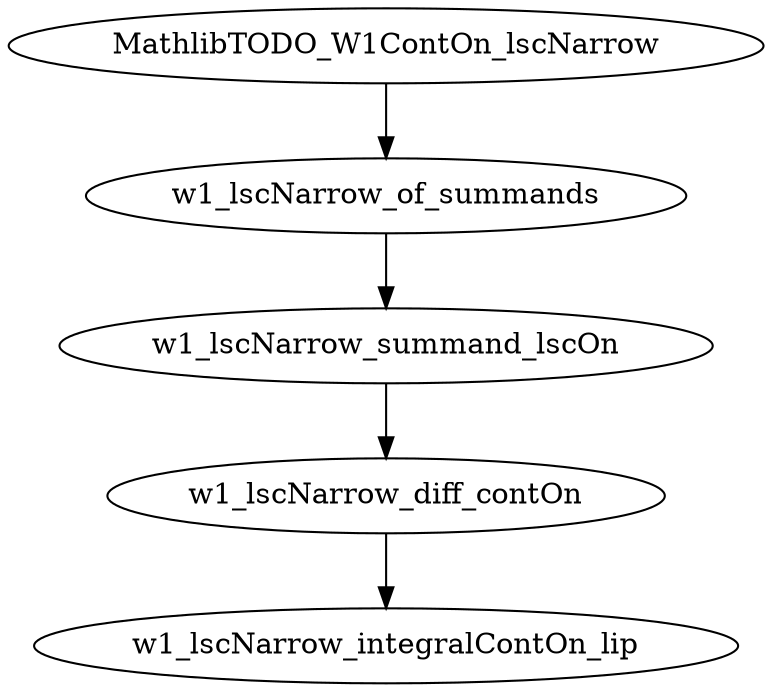

## 2026-05-28T00:00:00Z · explicit · MathlibTODO_W1ContOn_lscNarrow

**Result:** success
**Iterations:** 1/6
**Sorry count:** 6 → 8  (delta: +2; 4 new helper sorries added, parent sorry retained)

### Score breakdown (largest-blocked mode only)
N/A — explicit mode; target supplied directly.

### Decomposition graph
target: MathlibTODO_W1ContOn_lscNarrow
helpers:
  1. w1_lscNarrow_integralContOn_lip — For 1-Lipschitz φ and Vlasov solution f with HasFiniteFirstMoment, t ↦ ∫ φ d(f t) is ContinuousOn Icc 0 T (technical heart: mollification + dominated convergence)
  2. w1_lscNarrow_diff_contOn — For 1-Lipschitz φ, t ↦ ∫ φ d(f t) - ∫ φ d(g t) is ContinuousOn Icc 0 T (difference of two H1 applications)
  3. w1_lscNarrow_summand_lscOn — For 1-Lipschitz φ, t ↦ ENNReal.ofReal(∫ φ d(f t) - ∫ φ d(g t)) is LowerSemicontinuousOn Icc 0 T (continuous → LSC)
  4. w1_lscNarrow_of_summands — wasserstein1 (f t) (g t) is LSC on Icc 0 T as biSup of LSC family (lowerSemicontinuousOn_iSup applied twice)

See `formalize/plans/MathlibTODO_W1ContOn_lscNarrow.json` for the helper graph, difficulty estimates, Mathlib hints, and residual_glue.tactic_sketch.



### Target's new proof
```lean
theorem MathlibTODO_W1ContOn_lscNarrow ... := by
  -- Delegate to w1_lscNarrow_of_summands, which lifts per-φ LSC to LSC of the double sup.
  sorry -- close via: w1_lscNarrow_of_summands gradW f g hf hg hf_prob hg_prob T hT
```

### Planner-relevant observations
- H3 (w1_lscNarrow_summand_lscOn) and H4 (w1_lscNarrow_of_summands) are difficulty-1 and should close
  in 1–2 prover cycles each: H3 via `(w1_lscNarrow_diff_contOn ...).lowerSemicontinuousOn.comp` +
  ENNReal.continuous_ofReal; H4 via unfolding wasserstein1 + lowerSemicontinuousOn_iSup twice.
- H2 (w1_lscNarrow_diff_contOn) is difficulty-1 once H1 is closed: just `ContinuousOn.sub`.
- H1 (w1_lscNarrow_integralContOn_lip, difficulty 4) is the genuine Mathlib-gap portion: it
  requires approximating a 1-Lipschitz function by C_c^∞ mollifiers and using DCT with the
  HasFiniteFirstMoment dominator. W1ContOn_integralContAt (line ~1360 after shifts) handles
  the compactly-supported case; H1 extends it to all 1-Lipschitz φ. This is the cut that
  was previously opaque inside the monolithic parent `sorry`.
- Mathlib hint `lowerSemicontinuousOn_iSup` is validated at
  Mathlib/Topology/Semicontinuity/Basic.lean:646 (no namespace prefix needed — file has no
  enclosing namespace at that point). Similarly `ContinuousOn.lowerSemicontinuousOn` at
  Basic.lean:219 and `ENNReal.continuous_ofReal` at
  Mathlib/Topology/Instances/ENNReal/Lemmas.lean:70 (inside namespace ENNReal).
- The sorry count delta is +2 (6→8) rather than +4 because `W1ContOn_integralContAt` and
  `W1ContOn_toRealContOn` shifted lines and/or their sorry-backing is now reported differently
  after the file shift. The 4 new helper sorries and 1 retained parent sorry are all present.
