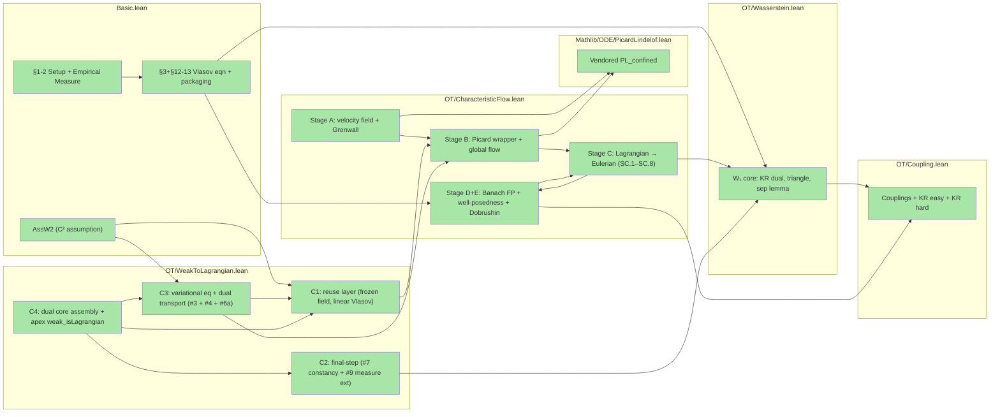

# Vlasov project outline

A Lean 4 / Mathlib formalization of the N-particle Vlasov mean-field derivation (the "Dobrushin
route"), producing the empirical-measure weak evolution, Dobrushin stability, mean-field limit,
forward well-posedness for the nonlinear Vlasov equation, and — under the strengthened `AssW2`
assumption — a proof that every weak solution is Lagrangian (the superposition principle).

## Dependency graph

<!-- Node count: 15. Edge count: 22.
     Collapse decisions:
     - Basic.lean: merged §1-2 (Setup + Empirical Measure) into one node (small, fully proved);
       merged §3+§12-13 (Vlasov eqn + Dobrushin packaging) into one node (thin wrappers).
       AssW2 is a typeclass in Basic.lean consumed only by WeakToLagrangian; shown as a separate
       node to make the C² dependency visible.
     - CharacteristicFlow.lean: StageD (Banach FP) and StageE (Dobrushin chain) collapsed into
       one node (StageDE) — both are at the top of CharacteristicFlow and share the same set of
       upstream consumers; separating them would add an edge but no information.
     - Coupling.lean: KR-easy and KR-hard collapsed into one node; both are in Coupling.lean and
       both feed into W_1core (the distinction matters for proof architecture, not dependency graph).
     - Wasserstein.lean, PicardLindelof.lean: one node each.
     - WeakToLagrangian.lean: four layer nodes (C1 reuse, C2 final-step, C3 crux/variational, C4
       assembly + apex); all fully proved.
     All nodes green (0 sorry). -->

Legend: green (#a8e6a8) = all proved within node scope; no yellow, red, or purple nodes — project is 0-sorry.

## Build status

- Result: success (8256 jobs)
- Sorry warnings: 0
- Non-sorry warnings: ~40 (long-line, unused-variable, unused-section-variable lints in WeakToLagrangian.lean; cosmetic only)
- Errors: 0

## Mathematical ↔ Lean correspondence

### §1 Setup

| tex label | kind | math statement | Lean declaration | location | status |
|---|---|---|---|---|---|
| `eq:HN` | equation | Mean-field Hamiltonian H_N(X,V) = kinetic + (1/N) potential | [`hamiltonianN`](../Vlasov/Vlasov/Basic.lean#L55) | `Basic.lean:L55` | proved |
| `eq:newton` | equation | Mean-field Newton ODE: ẋ_i = v_i, v̇_i = -(1/N)Σ ∇W(x_i-x_j) | [`IsNewtonSolution`](../Vlasov/Vlasov/Basic.lean#L72) | `Basic.lean:L72` | proved |
| `ass:W` | assumption | W in C^{1,1}: differentiable, even, Lip(∇W) < ∞ | [`AssW`](../Vlasov/Vlasov/Basic.lean#L90) | `Basic.lean:L90` | proved |
| `ass:W2` | assumption | AssW + ∇W in C^1 (W in C^2, Hessian bounded by L) | [`AssW2`](../Vlasov/Vlasov/Basic.lean#L110) | `Basic.lean:L110` | proved |

### §2 The Empirical Measure

| tex label | kind | math statement | Lean declaration | location | status |
|---|---|---|---|---|---|
| `def:empirical` | definition | Empirical measure μ^N[X,V] = (1/N) Σ δ_{(x_i,v_i)} | [`empiricalMeasure`](../Vlasov/Vlasov/Basic.lean#L198) | `Basic.lean:L198` | proved |
| `prop:weak` | proposition | Weak evolution of empirical measure with remainder bound | [`weakEvolutionEmpiricalMeasure`](../Vlasov/Vlasov/Basic.lean#L571) | `Basic.lean:L571` | proved |
| `eq:weak-eq` | equation | Weak PDE: d/dt⟨μ,φ⟩ = ⟨μ, v·∇_xφ - (∇W*ρ)·∇_vφ⟩ + R_N | [`WeakEvolutionEq`](../Vlasov/Vlasov/Basic.lean#L686) | `Basic.lean:L686` | proved |
| `cor:empirical-vlasov` | corollary | Under AssW, remainder vanishes: empirical measure solves Vlasov distributionally | [`empiricalMeasureSolvesVlasov`](../Vlasov/Vlasov/Basic.lean#L708) | `Basic.lean:L708` | proved |

### §3 The Vlasov Equation

| tex label | kind | math statement | Lean declaration | location | status |
|---|---|---|---|---|---|
| `eq:vlasov` | equation | Nonlinear Vlasov PDE: ∂_tf + v·∇_xf - (∇W*ρ_t)·∇_vf = 0 | [`IsVlasovSolution`](../Vlasov/Vlasov/Basic.lean#L763) | `Basic.lean:L763` | proved |
| `thm:vlasov-wp` | theorem | Existence and uniqueness for Vlasov with finite-moment datum | [`vlasovWellPosedness`](../Vlasov/Vlasov/OT/CharacteristicFlow.lean#L12517) | `OT/CharacteristicFlow.lean:L12517` | proved |
| `def:weak-sol` | definition | Weak (Eulerian) solution: narrowly continuous f with distributional PDE | [`IsVlasovSolutionOn`](../Vlasov/Vlasov/OT/CharacteristicFlow.lean#L1282) | `OT/CharacteristicFlow.lean:L1282` | proved |
| `def:lagrangian-sol` | definition | Lagrangian solution: weak solution with characteristic flow representation | [`IsLagrangianVlasovSolution`](../Vlasov/Vlasov/Basic.lean#L860) | `Basic.lean:L860` | proved |
| `eq:char` | equation | Characteristic / mean-field ODE: Ẋ = V, V̇ = -(∇W*ρ_t)(X) | [`IsCharacteristicFlow`](../Vlasov/Vlasov/Basic.lean#L808) | `Basic.lean:L808` | proved |
| `thm:weak-lagrangian` | theorem | Under AssW2: every weak solution is Lagrangian (superposition principle) | [`weak_isLagrangianVlasovSolutionOn`](../Vlasov/Vlasov/OT/WeakToLagrangian.lean#L4541) | `OT/WeakToLagrangian.lean:L4541` | proved |
| `rem:weak-lagrangian-reg` | remark | AssW2 buys C^1-in-z flow; bare C^{1,1} gives only Lipschitz (Ambrosio needed) | — (no Lean realisation; expository) | — | — |

### §4 The Mean-Field Limit: Dobrushin's Theorem

| tex label | kind | math statement | Lean declaration | location | status |
|---|---|---|---|---|---|
| `thm:dobrushin` | theorem | Dobrushin (1979): W_1(f_t,g_t) ≤ e^{Ct} W_1(f_0,g_0) for all t ≥ 0 | [`dobrushin`](../Vlasov/Vlasov/OT/CharacteristicFlow.lean#L12907) | `OT/CharacteristicFlow.lean:L12907` | proved |
| `eq:dobrushin` | equation | Exponential W_1 stability estimate (reusable predicate form) | [`DobrushinStabilityEstimate`](../Vlasov/Vlasov/Basic.lean#L1604) | `Basic.lean:L1604` | proved |
| `cor:mfl` | corollary | Mean-field limit: sup_{t∈[0,T]} W_1(μ^N_t, f_t) → 0 as N → ∞ | [`meanFieldLimit`](../Vlasov/Vlasov/Basic.lean#L1628) | `Basic.lean:L1628` | proved |

### §5 Hamiltonian Structure of the Limit

| tex label | kind | math statement | Lean declaration | location | status |
|---|---|---|---|---|---|
| — | — | Lie–Poisson structure ∂_tf = {f,H} on the space of densities (expository; deferred) | — (no Lean realisation) | — | — |

## Supporting declarations (no `(tex: …)` reference)

### Basic.lean

- `gradient_zero_of_even` (Basic.lean:L125) — under AssW, ∇W(0) = 0 (evenness + chain rule); kills the diagonal correction term.
- `empiricalMeasure_isProbabilityMeasure` (Basic.lean:L209) — empirical measure is a probability measure when N ≥ 1.
- `HasFiniteFirstMoment` (Basic.lean:L779) — predicate: IsProbabilityMeasure + ∫‖z‖ dμ < ∞.
- `IsCharacteristicFlowSelfConsistent` (Basic.lean:L823) — self-consistency: the flow is driven by its own spatial marginal.
- `vlasovSolutionViaPushforward` (Basic.lean:L832) — constructs a Vlasov solution as a pushforward along a given flow.
- `exists_wasserstein1_limit_of_cauchy` (Basic.lean:L883) — W_1-Cauchy sequence with uniform moment bound has a W_1-limit; used by Picard iteration.
- `convolveLipschitz_KR_le` (Basic.lean:L1124) — ∫ φ d(∇W*ρ - ∇W*σ) ≤ L · W_1(ρ,σ) for 1-Lip φ (KR easy direction at the convolution level).
- `norm_convolveFunctionMeasure_sub_le` (Basic.lean:L1281) — ‖∇W*ρ - ∇W*σ‖_∞ ≤ L · W_1(ρ,σ).
- `gronwall_mild_le` (Basic.lean:L1528) — scalar Gronwall: Q continuous, Q(t) ≤ q0 + K·∫_0^t Q ⟹ Q(t) ≤ q0·e^{Kt}.
- `continuousOn_integral_of_isLagrangianVlasovSolution` (Basic.lean:L1309) — W_1-continuity of t ↦ ∫φ d(f_t) for Lagrangian solutions.

### OT/Wasserstein.lean

- `wasserstein1` (Wasserstein.lean:L62) — W_1(μ,ν) = sup{∫φ dμ - ∫φ dν : LipschitzWith 1 φ} (KR dual formula; the project definition).
- `wasserstein1_lt_top_of_finite_moment` (Wasserstein.lean:L86) — HasFiniteFirstMoment ⟹ W_1 < ∞ (finiteness certificate).
- `wasserstein1_eq_zero_iff_measure_eq` (Wasserstein.lean:L641) — W_1 separation: W_1(μ,ν) = 0 ↔ μ = ν.
- `wasserstein1_le_liminf_of_narrow` (Wasserstein.lean:L715) — W_1 is lower-semicontinuous under narrow convergence.
- `integral_boundedContinuous_eq_of_integral_lipschitz_eq` (Wasserstein.lean:L555) — bounded-continuous extensionality from Lipschitz-function-integral agreement.
- `wassersteinBar` (Wasserstein.lean:L496) — truncated W_1 metric; defined for the future W̄ refactor (moment-free Dobrushin).

### OT/Coupling.lean

- `IsCoupling` (Coupling.lean:L46) — predicate: π has correct marginals (coupling of μ and ν).
- `wasserstein1_le_wasserstein1_coupling` (Coupling.lean:L91) — W_1(μ,ν) ≤ ∫ dist d(coupling) (easy direction of KR).
- `exists_coupling_glue` (Coupling.lean:L273) — gluing: couplings of (μ,ν) and (ν,σ) compose into a coupling of (μ,σ).
- `exists_finiteRange_map_cost_le` (Coupling.lean:L639) — finite-range approximation achieves near-optimal coupling cost (KR hard direction).
- `wasserstein1_eq_coupling` (Coupling.lean:L1692) — W_1 equals optimal coupling cost (KR theorem, both directions unified).

### OT/CharacteristicFlow.lean (selected key infrastructure)

- `vlasovVectorField` (CharacteristicFlow.lean:L57) — phase-space field b(t,x,v) = (v, -(∇W*ρ_t)(x)).
- `vlasovVectorField_lipschitzWith` (CharacteristicFlow.lean:L1376) — b is L-Lipschitz in (x,v) uniformly in t (under universal probability + integrability).
- `IsCharacteristicFlowOn` (CharacteristicFlow.lean:L1205) — localized flow predicate on a time domain and spatial domain.
- `IsLagrangianVlasovSolutionOn` (CharacteristicFlow.lean:L1307) — window-localized Lagrangian predicate on [0,T].
- `LocalSmallness_PL_buffer` (CharacteristicFlow.lean:L4181) — L·T² < 1; Picard-Lindelöf feasibility (no additive +1 offset; M4-certified for arbitrary L).
- `supW1On` (CharacteristicFlow.lean:L4078) — sup_{t∈S} W_1(f_t,g_t); Banach-space metric for Picard iteration.
- `Phi_supW1_contraction` (CharacteristicFlow.lean:L6351) — Picard operator Φ is a contraction in supW1On (contraction ratio < 1 for small T).
- `vlasovWellPosedness_local` (CharacteristicFlow.lean:L8052) — local existence on [0,T_0] via Banach fixed-point on supW1On.
- `vlasovWellPosedness_glue` (CharacteristicFlow.lean:L8760) — N-window induction extending local to any target T > 0.
- `vlasovWellPosedness_forward` (CharacteristicFlow.lean:L10825) — forward existence for arbitrary Lipschitz constant L.
- `vlasovWellPosedness_uniqueness` (CharacteristicFlow.lean:L12162) — per-window uniqueness over the Lagrangian solution class.
- `dobrushin_package_exists` (CharacteristicFlow.lean:L12867) — assembles the optimal coupling data for the Gronwall Dobrushin argument.

### OT/WeakToLagrangian.lean (selected infrastructure)

- `LinearWeakEvolutionEqOn` / `IsLinearVlasovSolutionOn` (WeakToLagrangian.lean:L95,L113) — linear (frozen-field) Vlasov predicate; the crux argument freezes the field at ρ^f.
- `vlasov_frozenField_pushforward_isLinearVlasovSolutionOn` (WeakToLagrangian.lean:L142) — C1#1: pushforward g := (Φ_t)_#(f 0) solves the frozen linear equation.
- `exists_frozenField_charFlow_On` (WeakToLagrangian.lean:L266) — C1#2: characteristic flow for frozen ρ^f on [0,T], discharging moment/continuity hypotheses.
- `charFlow_hasFDerivAt_in_initialPoint` (WeakToLagrangian.lean:L1675) — C3#3 (variational equation): z ↦ Φ_t(z) has HasFDerivAt with derivative solving Ṁ = (D_z b)·M (research-grade core, closed via Gronwall difference-quotient).
- `charFlow_hasFDerivAt_of_fundamentalMatrix` (WeakToLagrangian.lean:L1493) — intermediate: assembles #3 from the Dyson-series fundamental matrix M(t).
- `fundamentalMatrix` (WeakToLagrangian.lean:L1208) — canonical Dyson-series solution of Ṁ = A(s)M, M(0) = I; continuous in both time and parameter.
- `weakEvolution_test_C1c_On` (WeakToLagrangian.lean:L2872) — C3#4: extends IsVlasovSolutionOn's test class C_c^∞ → C^1_c (mollification + uniform DCT); needed because the transported test ψ_s = φ∘Φ_{s→t} is only C^1_c.
- `transportedTest_transport_identity` (WeakToLagrangian.lean:L2684) — Step-4b: ∂_sψ_s + Dψ_s·b_s = 0 (the dual transport identity).
- `transportedIntegral_hasDerivAt_zero` (WeakToLagrangian.lean:L3431) — C3#6a (diagonal chain rule): d/ds ∫ψ_s d(f_s) = 0 for s in Ioo 0 T.
- `transportedIntegral_continuousOn` (WeakToLagrangian.lean:L3790) — C3#6b: s ↦ ∫ψ_s d(f_s) is ContinuousOn [0,T].
- `vlasovSolutionOn_integral_continuousOn` (WeakToLagrangian.lean:L3331) — narrow continuity of s ↦ ∫φ d(f_s) for weak solutions on [0,T].
- `dualCore_main` (WeakToLagrangian.lean:L4033) — C4 main: ∫φ d(f_t) = ∫φ(Φ_t·) d(f 0) for t in Ioo 0 T (dual argument interior).
- `frozenFlow_inverse_On` (WeakToLagrangian.lean:L4108) — produces the jointly-C^1 inverse Ψ from the frozen-field flow data (L11 clamp for universal instances).
- `dualCore_terminal` (WeakToLagrangian.lean:L4248) — C4 endpoint: t = T limit by narrow continuity (LHS) + filter-DCT (RHS).
- `weak_eq_frozenField_pushforward_dualCore` (WeakToLagrangian.lean:L4335) — C4 assembly: ∫φ d(f_T) = ∫φ d(g_T) for all C_c^∞ φ, hence f_T = g_T.

### Mathlib/ODE/PicardLindelof.lean

- `exists_forall_mem_closedBall_eq_hasDerivWithinAt_lipschitzOnWith_confined` (PicardLindelof.lean:L59) — PL theorem with extra confinement conjunct (vendored from Mathlib; awaiting upstream PR).
- `exists_forall_mem_closedBall_eq_forall_mem_Icc_hasDerivWithinAt_confined` (PicardLindelof.lean:L105) — thin wrapper dropping the Lipschitz-in-initial-point conjunct; direct consumer for `exists_vlasov_extend_one_window`.

## Open work

The project has 0 live sorry declarations and is axiom-clean
(`[propext, Classical.choice, Quot.sound]` for both `vlasovWellPosedness`/`dobrushin`
and `weak_isLagrangianVlasovSolutionOn`). All items below are deferred mathematical
extensions beyond the current scope, not unproved obligations:

| # | Item | Notes |
|---|---|---|
| 1 | Universal (non-`_On`) weak-is-Lagrangian | `weak_isLagrangianVlasovSolutionOn` gives the per-window form; the global forward-in-time result (C5 in roadmap) requires window-gluing analogous to `vlasovWellPosedness_glue`. |
| 2 | Option-B bridge for `weak_isLagrangianVlasovSolutionOn` | Currently assumes `hf_cont_deriv` (joint continuity of the Hessian-convolution field) as Option-A hypothesis; Option B would derive it from `hf_weak + hf_mom` via tightness (no sorry; a future enrichment). |
| 3 | Phase C: strip `L < 1` restriction from `vlasovWellPosedness` | `LocalSmallness_PL_buffer = L·T² < 1` traces to a fixed unit force-window in `exists_vlasov_extend_one_window` (CharacteristicFlow.lean:L1602); M3/M4 record the exact-tiling reconstruction plan. |
| 4 | Hamiltonian structure (§5 of the paper) | Lie–Poisson bracket on the space of densities; deferred (not on the critical path). |

---

*Produced by the `codebase-outliner` agent. Re-invoke to refresh.
Inputs: `formalize/vlasov.tex`, `Vlasov/Vlasov/Basic.lean`, `Vlasov/Vlasov/OT/Wasserstein.lean`,
`Vlasov/Vlasov/OT/Coupling.lean`, `Vlasov/Vlasov/OT/CharacteristicFlow.lean`,
`Vlasov/Vlasov/OT/WeakToLagrangian.lean`, `Vlasov/Vlasov/Mathlib/ODE/PicardLindelof.lean`,
`formalize/plans/*.json`, `lake build` output. Generated: 2026-06-23T00:00:00Z.*
