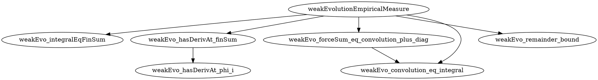

## 2026-05-23T22:39:16 · explicit · weakEvolutionEmpiricalMeasure

**Result:** (in progress)
**Iterations:** 0/6
**Sorry count:** 3 → (pending)

### Selection
Mode: explicit. Target resolved: `Vlasov.weakEvolutionEmpiricalMeasure` (line 239, sorry at line 277, tex-label prop:weak).

### Decomposition plan

The theorem has three parts:
  1. Produce a remainder `r` with an explicit formula.
  2. Prove `HasDerivAt` for the empirical measure integral at `t`.
  3. Prove the remainder bound `|r| ≤ (1/N) ‖gradW‖_∞ ‖gradVφ‖_∞`.

The `HasDerivAt` part decomposes into:
  A. Rewrite the integral as a finite sum (`∫ φ d(empiricalMeasureCurve) = (1/N) Σᵢ φ(X t i, V t i)`).
  B. Differentiate the finite sum term-by-term via `HasDerivAt.sum`.
  C. Apply chain rule to each `φ(X t i, V t i)`.
  D. Substitute Newton equations into the velocity terms.
  E. Rearrange the force sum to isolate convolution + diagonal remainder.

**Helper lemmas** (6 total):

1. `weakEvo_integralEqFinSum` — The empirical-measure integral equals (1/N) times a finite sum:
   `∫ φ d(empiricalMeasureCurve N X V t) = (1 / N) * ∑ i, φ (X t i, V t i)`.
   TODO(mathlib): Uses `integral_finset_sum` + `integral_dirac` + `Measure.smul_apply`.

2. `weakEvo_hasDerivAt_phi_i` — For each particle i, the map `t ↦ φ(X t i, V t i)`
   has derivative `⟨V t i, gradXφ (X t i, V t i)⟩ + ⟨velocity_deriv i, gradVφ (X t i, V t i)⟩`
   where `velocity_deriv` is the Newton RHS.
   TODO(mathlib): Requires `HasDerivAt.inner` + `HasFDerivAt` chain rule for `φ`.

3. `weakEvo_hasDerivAt_finSum` — The finite sum `∑ i, φ(X t i, V t i)` has
   derivative `∑ i, (d/dt φ(X t i, V t i))` via `HasDerivAt.sum` (finitely many terms).
   TODO(mathlib): Direct application of `HasDerivAt.sum`.

4. `weakEvo_forceSum_eq_convolution_plus_diag` — The per-particle force contribution
   rewrites as convolution plus diagonal:
   `∑ j, (if j ≠ i then gradW (X t i - X t j) else 0) = (1/N) * ∑ j, gradW (X t i - X t j) - (1/N) * gradW 0`.
   This is the key algebraic identity separating convolution from the diagonal.
   TODO(mathlib): Elementary reindex identity using `Finset.sum_ite`.

5. `weakEvo_convolution_eq_integral` — The discrete convolution sum expresses
   the empirical spatial marginal convolution:
   `(1/N) ∑ j, gradW (x - X t j) = convolveFunctionMeasure gradW (spatialMarginal (empiricalMeasureCurve N X V t)) x`.
   TODO(mathlib): Unfold `convolveFunctionMeasure`, `spatialMarginal`, `empiricalMeasure`,
   then use `integral_smul` + `integral_finset_sum` + `integral_dirac`.

6. `weakEvo_remainder_bound` — The diagonal remainder satisfies the pointwise bound:
   `|(1/N²) ∑ i, ⟨gradW 0, gradVφ (X t i, V t i)⟩| ≤ (1/N) * (⨆ x, ‖gradW x‖) * (⨆ z, ‖gradVφ z‖)`.
   TODO(mathlib): Standard `abs_sum_le` + `inner_le_iff` + `iSup` monotonicity.

### Combinator sketch
```lean
theorem weakEvolutionEmpiricalMeasure ... := by
  refine ⟨(1 / (N : ℝ)^2) * ∑ i : Fin N,
            @inner ℝ (PhysSpace d) _ (gradW 0) (gradVφ (X t i, V t i)), rfl, ?_, ?_⟩
  · -- HasDerivAt part
    have hsum := weakEvo_integralEqFinSum N φ X V t
    rw [show (fun s => ...) = (fun s => (1/N) * ∑ i, φ (X s i, V s i)) from ...]
    apply (weakEvo_hasDerivAt_finSum ...).congr_deriv
    ...
    exact weakEvo_forceSum_eq_convolution_plus_diag ...
    exact weakEvo_convolution_eq_integral ...
  · -- Remainder bound
    exact weakEvo_remainder_bound ...
```

### Decomposition graph
target: weakEvolutionEmpiricalMeasure
helpers:
  1. weakEvo_integralEqFinSum — integral over empirical measure = (1/N) finite sum
  2. weakEvo_hasDerivAt_phi_i — chain rule for φ along each particle trajectory
  3. weakEvo_hasDerivAt_finSum — differentiate the finite sum term-by-term
  4. weakEvo_forceSum_eq_convolution_plus_diag — algebraic split of force sum
  5. weakEvo_convolution_eq_integral — discrete sum = empirical convolution integral
  6. weakEvo_remainder_bound — bound the diagonal correction term



