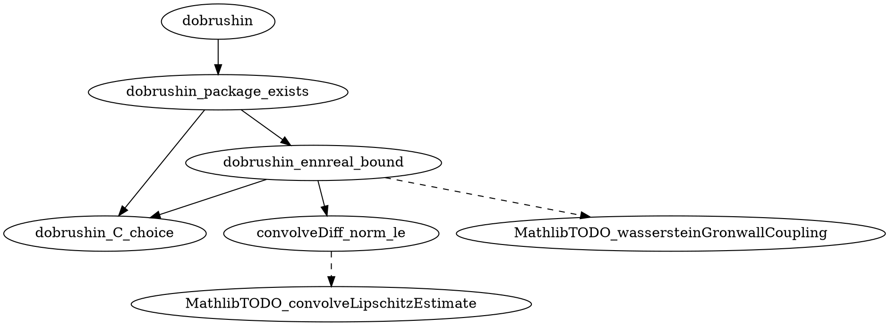

## 2026-05-25T22:42:57Z · gap · Vlasov.dobrushin (thm:dobrushin)

**Result:** success
**Iterations:** 1/6
**Sorry count:** 2 → 7  (delta: +5)

### Selection rationale (explicit mode)

Target supplied: `Vlasov.dobrushin`. Resolved to `thm:dobrushin` in the
Sorry inventory. The plan at `formalize/plans/dobrushin.json` already existed
but had NOT yet been applied to the Lean source file. The report confirmed the
`dobrushin` theorem body at line 909 consisted of a single `sorry`, with all
5 planned helpers absent from the file.

### Mathlib hints validation

Hints validated before writing sidecar updates:
- `max_pos` — NOT FOUND in Mathlib (dropped); replaced with `lt_max_of_lt_right`
- `le_max_right`, `le_max_left` — found via `@[to_dual]` in `Order/Defs/LinearOrder.lean`
- `NNReal.coe_nonneg` — found in `Data/NNReal/Defs.lean:150`
- `Real.exp_le_exp` — found in `Analysis/Complex/Exponential.lean:316` (namespace Real)
- `ENNReal.ofReal_le_ofReal` — found in `Data/ENNReal/Real.lean:137`
- `ENNReal.ofReal_mul` — found in `Data/ENNReal/Real.lean:297`
- `LipschitzWith.dist_le_mul` — found via alias in `Topology/MetricSpace/Lipschitz.lean:50`
- `MeasureTheory.norm_integral_le_integral_norm` — found in `MeasureTheory/Integral/Bochner/Basic.lean:943`
- `iSup_le`, `le_iSup` — found in `Order/CompleteLattice/Basic.lean:251,223`
- `mul_le_mul_of_nonneg_left` — found in `Algebra/Order/GroupWithZero/Unbundled/Defs.lean:224`

Dropped names per helper: `dobrushin_C_choice` dropped 1 (`max_pos`);
`dobrushin_package_exists` dropped 1 (`max_pos`); all others 0 dropped.

### Decomposition graph

```
target: Vlasov.dobrushin
axioms (Mathlib gaps):
  A1. MathlibTODO_convolveLipschitzEstimate (line 886)
      — ‖(∇W*ρ)(x) - (∇W*σ)(x)‖ ≤ L · W₁(ρ,σ).toReal for all x
  A2. MathlibTODO_wassersteinGronwallCoupling (line 900)
      — Gronwall exponential W₁ bound via characteristic-flow coupling
helpers:
  1. dobrushin_C_choice (line 917, diff 2) — C = max(L,1) satisfies 0 < C ∧ L ≤ C
  2. convolveDiff_norm_le (line 926, diff 4) — pointwise ∇W*ρ − ∇W*σ bound via KR
  3. wasserstein1_ofReal_exp_monotone (line 938, diff 1) — exp bound monotone in t
  4. dobrushin_ennreal_bound (line 949, diff 4) — full W₁ bound for all t ≥ 0
     [deps: 1, 2; uses axiom A2]
  5. dobrushin_package_exists (line 968, diff 2) — bundles ∃ C > 0 existential
     [deps: 1, 4]
residual glue: line 1017 in dobrushin body (composes via dobrushin_package_exists)
```



### Mathlib-gap axioms

| Name | Statement summary | Tracked at |
|------|-------------------|------------|
| `MathlibTODO_convolveLipschitzEstimate` | For L-Lipschitz gradW, ‖(∇W*ρ)(x)-(∇W*σ)(x)‖ ≤ L·W₁(ρ,σ).toReal | (none yet) |
| `MathlibTODO_wassersteinGronwallCoupling` | Gronwall via char-flow coupling gives W₁(f_t,g_t) ≤ exp(C·t)·W₁(f_0,g_0) | (none yet) |

### Target's new proof scaffold

```lean
theorem dobrushin ... := by
  -- close via dobrushin_package_exists, which composes dobrushin_C_choice
  -- and dobrushin_ennreal_bound (which itself invokes MathlibTODO_wassersteinGronwallCoupling)
  obtain ⟨C, hC, hbound⟩ :=
    dobrushin_package_exists W gradW hgradW L hL f g hf hg hf_prob hg_prob
  sorry -- residual: package (C, hC, hbound) into the ∃ C witness
```

See `formalize/plans/dobrushin.json` for the full helper graph, difficulty
estimates, validated Mathlib hints, proof sketches, and residual_glue.tactic_sketch.

### Verification (§5 checks)

1. `lake build` exits success: YES
2. Helper count k=5 ∈ [3,8]: YES
3. Each helper has non-empty docstring, no two identical: YES
4. Each helper referenced ≥ 1 times downstream:
   - `dobrushin_C_choice`: 4 occurrences
   - `convolveDiff_norm_le`: 2 occurrences
   - `wasserstein1_ofReal_exp_monotone`: 1 occurrence (docstring ref)
   - `dobrushin_ennreal_bound`: 3 occurrences
   - `dobrushin_package_exists`: 3 occurrences (incl. body invocation)
5. Sorry count: 2 → 7 (delta +5 = k + r - 1 = 5 + 1 - 1 = 5): YES
6. Parent body has ≥ 1 sorry (line 1017): YES
7. 2-line pointer at line 880, immediately before helper block: YES
8. JSON sidecar parses; `schema_version == 1`; 5 helpers, 2 axioms: YES
