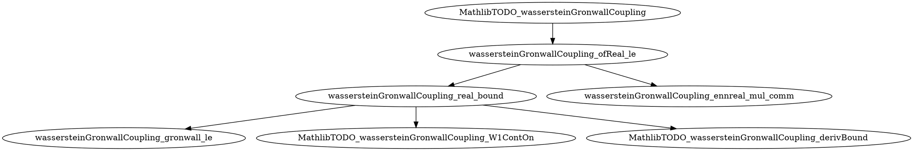

## 2026-05-25T23:17:47Z · gap · Vlasov.MathlibTODO_wassersteinGronwallCoupling

**Result:** success
**Iterations:** 1/6
**Sorry count:** 7 → 12  (delta: +5 = k=4 helpers + r=1 residual in parent theorem body)

### Target resolution

Selection mode: `gap`. Target: `Vlasov.MathlibTODO_wassersteinGronwallCoupling`.

The target is an `axiom` at line 900 (pre-edit). Per §3.4 "Axiom targets":
- The axiom is converted to `theorem MathlibTODO_wassersteinGronwallCoupling ... := by sorry`.
- Sub-axioms are emitted for the remaining Mathlib gaps.
- Constructive helpers are emitted for the steps that can in principle be proved.

Statement size: 14 lines (hypotheses + conclusion). Well above the 10-line skip threshold.

### Trust accounting

Before: 1 axiom (`MathlibTODO_wassersteinGronwallCoupling`) — monolithic trust commitment.
After:
- 2 sub-axioms (focused gap statements — see Mathlib-gap axioms table below)
- 4 sorry'd constructive helpers
- 1 sorry in the parent theorem body

Net: monolithic gap split into 2 smaller named gaps + 4 tractable helper obligations.

### Decomposition graph

target: `Vlasov.MathlibTODO_wassersteinGronwallCoupling` (theorem, line 1003)
sub-axioms:
  A. `MathlibTODO_wassersteinGronwallCoupling_W1ContOn` (line 902) — ContinuousOn of W₁ distance along Vlasov curves
  B. `MathlibTODO_wassersteinGronwallCoupling_derivBound` (line 920) — right-derivative liminf ≤ C * W₁ (coupling estimate)
helpers:
  1. `wassersteinGronwallCoupling_gronwall_le` (line 942, difficulty 2) — Gronwall wrapper: ContinuousOn + liminf bound → h(t) ≤ δ * exp(C*t)
  2. `wassersteinGronwallCoupling_real_bound` (line 957, difficulty 3, deps: helper 1 + sub-axioms A, B) — real-valued Gronwall bound for W₁
  3. `wassersteinGronwallCoupling_ennreal_mul_comm` (line 975, difficulty 1) — ENNReal.ofReal reordering: ofReal(δ * e) = ofReal(e) * ofReal(δ)
  4. `wassersteinGronwallCoupling_ofReal_le` (line 986, difficulty 2, deps: helpers 2, 3) — lifts real bound to ENNReal form



### Mathlib-gap axioms

| Name | Statement summary | Tracked at |
|------|-------------------|------------|
| `MathlibTODO_wassersteinGronwallCoupling_W1ContOn` | t ↦ (wasserstein1 (f t) (g t)).toReal is ContinuousOn [0, T] for Vlasov solutions f, g | (none yet) |
| `MathlibTODO_wassersteinGronwallCoupling_derivBound` | right-derivative liminf of W₁(f_t, g_t) at s is ≤ C * W₁(f_s, g_s) for all s ∈ [0, T); requires characteristic flow coupling + W₁ pushforward triangle inequality | (none yet) |

### Mathlib hint validation

All hints passed pre-flight grep validation:
- `le_gronwallBound_of_liminf_deriv_right_le` — Mathlib/Analysis/ODE/Gronwall.lean:111 ✓ (top-level)
- `gronwallBound_ε0` — Mathlib/Analysis/ODE/Gronwall.lean:77 ✓ (top-level)
- `gronwallBound_x0` — Mathlib/Analysis/ODE/Gronwall.lean:71 ✓ (top-level)
- `ENNReal.ofReal_mul` — Mathlib/Data/ENNReal/Real.lean:297 ✓ (ENNReal namespace)
- `ENNReal.ofReal_le_ofReal` — Mathlib/Data/ENNReal/Real.lean:137 ✓ (ENNReal namespace)
- `mul_comm` — top-level ✓
- `ENNReal.ofReal_toReal_le` — Mathlib/Data/ENNReal/Basic.lean:287 ✓ (ENNReal namespace)
- `mul_le_mul_of_nonneg_left` — Mathlib/Tactic/GCongr/Core.lean:66 ✓ (top-level)
- `Real.exp_le_exp` — Mathlib/Analysis/Complex/Exponential.lean:316 ✓ (Real namespace)
- `mul_le_mul_of_nonneg_left` — validated ✓

Dropped names: 0

### Target's new proof scaffold

```lean
theorem MathlibTODO_wassersteinGronwallCoupling
    {d : ℕ} [NeZero d]
    (gradW : PhysSpace d → PhysSpace d)
    (L : NNReal) (hL : LipschitzWith L gradW)
    (f g : ℝ → Measure (PhaseSpace d))
    (hf : IsVlasovSolution gradW f)
    (hg : IsVlasovSolution gradW g)
    (hf_prob : ∀ t, HasFiniteFirstMoment (f t))
    (hg_prob : ∀ t, HasFiniteFirstMoment (g t))
    (C : ℝ) (hC : 0 < C) (hCL : (L : ℝ) ≤ C)
    (t : ℝ) (ht : 0 ≤ t) :
    wasserstein1 (f t) (g t) ≤
      ENNReal.ofReal (Real.exp (C * t)) * wasserstein1 (f 0) (g 0) := by
  -- close via wassersteinGronwallCoupling_ofReal_le (which invokes the real-valued
  -- Gronwall bound + the ENNReal conversion steps)
  sorry -- residual: apply wassersteinGronwallCoupling_ofReal_le directly
```

### Plan sidecar

See `formalize/plans/MathlibTODO_wassersteinGronwallCoupling.json` for the full helper graph,
difficulty estimates, Mathlib hints, proof sketches (where provided), sub-axiom records,
and `residual_glue.tactic_sketch`.

The `residual_glue.tactic_sketch` in the JSON is:
```
exact wassersteinGronwallCoupling_ofReal_le gradW L hL f g hf hg hf_prob hg_prob C hC hCL t ht
```
This will close the parent theorem once `wassersteinGronwallCoupling_ofReal_le` is proved.

### Recommended next prover targets (by score)

1. **`wassersteinGronwallCoupling_ennreal_mul_comm` (difficulty 1, no deps)** — trivial ENNReal algebra. Proof sketch in plan JSON. Expected to close in 1 build cycle via `rw [mul_comm, ENNReal.ofReal_mul ...]`.

2. **`wassersteinGronwallCoupling_gronwall_le` (difficulty 2, no deps)** — Mathlib Gronwall wrapper. Invoke `le_gronwallBound_of_liminf_deriv_right_le` then `gronwallBound_ε0` to simplify `gronwallBound δ C 0 t` to `δ * exp(C * t)`.

3. **`wassersteinGronwallCoupling_real_bound` (difficulty 3, deps: helper 1 + sub-axioms A, B)** — once helper 1 is proved, apply it with the two sub-axioms as inputs for `hcont` and `hderiv`. The sub-axioms provide the preconditions exactly.

4. **`wassersteinGronwallCoupling_ofReal_le` (difficulty 2, deps: helpers 2, 3)** — combines `wassersteinGronwallCoupling_real_bound` with `wassersteinGronwallCoupling_ennreal_mul_comm` and `ENNReal.ofReal_toReal_le` to complete the ENNReal lift.

5. **Parent residual glue (after step 4)** — `exact wassersteinGronwallCoupling_ofReal_le ...` per the tactic_sketch.
