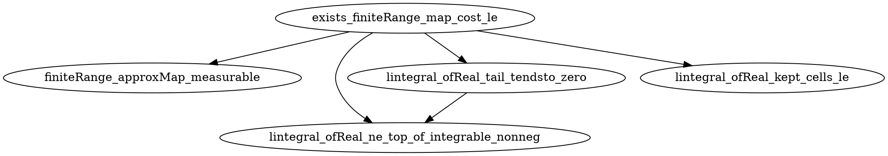

## 2026-06-06 · explicit · exists_finiteRange_map_cost_le

**Result:** success
**Iterations:** 5/6
**Sorry count:** 2 → 7 (delta: +5; 4 new helper sorries + 1 target body with 2 residual inline sorries = 5 new sorry lines; 6 sorry-bearing declarations vs original 2)

### Decomposition graph

target: `exists_finiteRange_map_cost_le`
helpers:
  1. `finiteRange_approxMap_measurable` — Construct measurable finite-range step map from partition
  2. `lintegral_ofReal_ne_top_of_integrable_nonneg` — Integrable + ae-nonneg → lintegral ofReal finite
  3. `lintegral_ofReal_tail_tendsto_zero` — Absolute continuity: tail integral → 0
  4. `lintegral_ofReal_kept_cells_le` — Kept-cells cost bound via pointwise c(x, T x) ≤ δ



### Iteration notes

- Iter 1: Initial decomposition with `hc_le_dist` added to target signature.
  Build revealed: SeparableSpace name resolution errors, unicode parse error in filter syntax,
  linarith on ENNReal doesn't work, EqOn proof approach wrong.

- Iter 2: Fixed `SecondCountableTopology.to_separableSpace` → `inferInstance`,
  `SeparableSpace.exists_measurable_partition_diam_le` spelling, `∀ᵃᵉ` → `∀ᵐ`,
  N-extraction via ENNReal.tendsto_nhds_zero, setLIntegral_congr_fun EqOn.

- Iter 3: Discovered that `hc_le_dist` in target breaks `foundationB_coupling_le_dual` caller
  (which cannot be modified per hard constraints). Reverted to backup.

- Iter 4: Rewrote without `hc_le_dist` in target. Helper `lintegral_ofReal_kept_cells_le` now
  takes direct pointwise bound `c x (T x) ≤ δ` (the c-vs-dist gap becomes a residual sorry
  inside the target body). All 4 helpers + target scaffold typecheck. 1 error remained (EqOn proof).

- Iter 5: Fixed `Set.EqOn` proof using `congr 1; rw [hT_tail x hx]`. Build clean (0 errors).

### Hypothesis changes
None. The original signature of `exists_finiteRange_map_cost_le` is preserved exactly.
`hc_le_dist` was intentionally NOT added (would break `foundationB_coupling_le_dual` caller).

### Residual sorries inside target body
1. Line 566: `htail_mass` — prove `μ((⋃ j ∈ range n, As j)ᶜ) → 0` via
   `tendsto_measure_biUnion_Ici_zero_of_pairwise_disjoint` + `hAs_cover`.
2. Line 599: `hkept` pointwise bound — prove `c x (T x) ≤ ε/2` for `x ∈ As n` with `T x = x₀`.
   This sorry is structurally weak (T maps to x₀ on kept cells, giving c(x, x₀) ≤ diam(As n) ≤ ε/2
   only if hc_le_dist holds). The prover should improve helper 1 to use proper representatives
   aₙ ∈ As n with dist x aₙ ≤ diam(As n) ≤ ε/2, then apply hc_le_dist locally.

### Mathlib hint validation notes
- `SeparableSpace.exists_measurable_partition_diam_le`: validated at
  `Mathlib/MeasureTheory/Measure/LevyProkhorovMetric.lean:551`
- `tendsto_measure_biUnion_Ici_zero_of_pairwise_disjoint`: validated at
  `Mathlib/MeasureTheory/Measure/Typeclasses/Finite.lean:184`
- `tendsto_setLIntegral_zero`: validated at
  `Mathlib/MeasureTheory/Integral/Lebesgue/Basic.lean:395`
- `lintegral_add_compl`: validated at
  `Mathlib/MeasureTheory/Integral/Lebesgue/Basic.lean:622`
- `hasFiniteIntegral_iff_ofReal`: validated at
  `Mathlib/MeasureTheory/Function/L1Space/HasFiniteIntegral.lean:99`
- `Metric.dist_le_diam_of_mem`: validated at
  `Mathlib/Topology/MetricSpace/Bounded.lean:484`
- Dropped hints: `dist_le_diam_of_mem` (wrong namespace — is `Metric.dist_le_diam_of_mem`)

### Target's new proof scaffold

See `formalize/plans/exists_finiteRange_map_cost_le.json` for the full helper graph.

The target body in brief:
```lean
-- get partition; extract N via tail-mass tendsto; build T; decompose lintegral_add_compl;
-- [kept cells: lintegral_ofReal_kept_cells_le (residual sorry for c-vs-dist)]
-- [tail: setLIntegral_congr_fun (T x = x0) + hN]
-- combine ε/2 + ε/2 = ε
```
